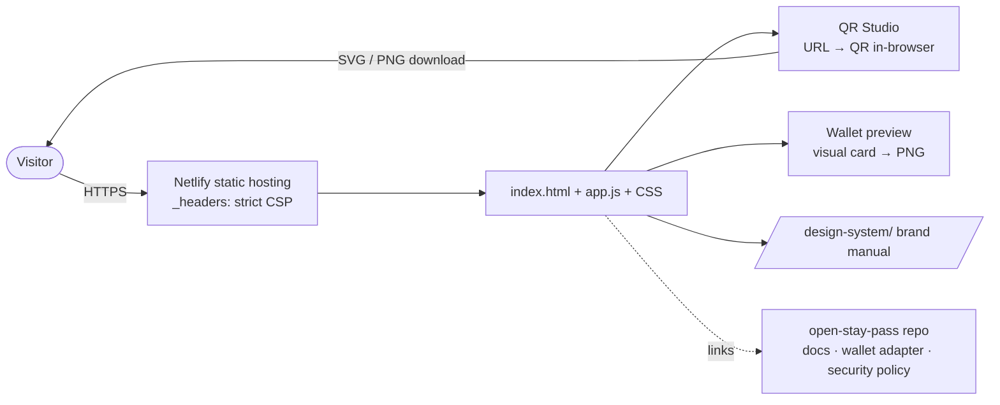

<p align="center">
  
</p>

<h1 align="center">Stay Pass QR Studio</h1>

<p align="center"><b>Community site and browser-only QR Studio for Open Stay Pass</b></p>

<p align="center">
  <a href="LICENSE"></a>
  
  
</p>

The community site for [Open Stay Pass](https://github.com/FriskyDevelopments/open-stay-pass), the MIT-licensed, self-hostable guest-credential rail. It's a static, bilingual (EN/ES) page with a **QR Studio**: paste a public URL and it generates a 512 × 512 QR code (error correction M) **entirely in your browser**, downloadable as SVG or PNG. It also shows **Wallet previews**, visual Apple/Google Wallet cards carrying the same URL that you can download as a PNG, plus the Open Stay Pass brand manual / design system. The studio does **not** sign credentials, grant access or issue real `.pkpass` / Google Wallet saves. Those stay configuration-required adapters on the self-hosted credential server. It's for hosts, contributors and anyone evaluating Open Stay Pass.

- Live: https://stay-pass-qr-studio.netlify.app
- Press kit: https://staypass-pmz7aqns.manus.space/press-kit

## Architecture



## Stack

- Plain HTML + CSS. `app.js` is a **prebuilt** ES module bundle that includes the QR encoder.
- EN/ES language toggle
- Netlify static hosting, with security headers in `_headers` (CSP `default-src 'self'`, no referrer, frame DENY)

## Project structure

```text
index.html        landing + QR Studio + Wallet preview
app.js            bundled studio logic (QR encoder, downloads, i18n)
styles.css, brand.css
conduct.html, license.html
assets/           wolf marks, signed-stroke marks, pictograms, OSP tokens CSS
design-system/    Open Stay Pass brand manual (tokens, components, guidelines)
_headers          security headers
netlify.toml      no build step, publish "."
```

## Local development

There's no build step and no package manager. Serve the folder with any static server, for example:

```bash
python3 -m http.server 8080
# open http://localhost:8080
```

Note: the source for `app.js` isn't in this repository; only the bundled output is committed.

## Deploy

Netlify serves the repo root as-is (`netlify.toml`: build command `true`, publish `.`), and `_headers` sets the security headers. This hosted community project is free to use and contains no paid plans, advertising, subscriptions, lead capture or commercial transactions.

## Community

- Code of Conduct: [CODE_OF_CONDUCT.md](CODE_OF_CONDUCT.md)
- Contributing and security policy: see the [open-stay-pass](https://github.com/FriskyDevelopments/open-stay-pass) repository

## License

See [LICENSE](LICENSE).
